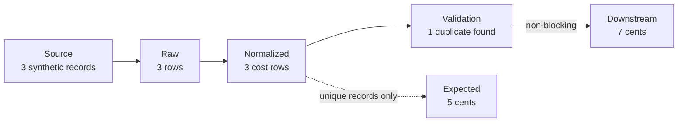

# Complete an evidence-centered lesson

Use this guide after a sanitized Learning Pack has been promoted. Do not use
the lesson to inspect private intake, test a live system, or prove a real
production claim. Version one teaches one judgment with fixed public synthetic
data:

> A green ETL run does not, by itself, prove downstream data is valid.

## Shortest correct path

1. Open **Accepted packs** in the local Product Shell.
2. Open **Synthetic Codex ETL**.
3. Open **Prove what a green ETL run does not prove**.
4. Complete the ordered loop:
   **Map → Predict → Try → Prove → Explain → Review**.
5. On Review, check the Mastery State and the Learner Attempt ID.

The Product Shell does not reveal the result before it records a prediction
and confidence.

## What the lesson simulates



The uniqueness rule reports a failure but does not stop processing. The
downstream representation therefore includes the duplicate.

The scenario is deterministic. The lesson binds:

- one sanitized Learning Pack version and digest;
- one lesson and outcome revision;
- one public scenario input digest;
- seed `7`; and
- an ordered renderer action history.

Running the same input, seed, and effective actions produces the same
observations and state hash. **Reset this scenario** clears the effective
action while retaining the reset in the attempt history.

## How evidence is evaluated

The exact claim needs three Evidence Cards:

| Card | Why it is needed |
|---|---|
| Validation policy | Proves the uniqueness rule is non-blocking. |
| Validation result | Proves this scenario contains one duplicate excess row. |
| Downstream snapshot | Proves this scenario published 7 cents rather than 5. |

The learner must reject **Green job status** as insufficient. It proves the
process completed. It does not prove uniqueness, freshness, or correctness.

The deterministic core evaluates the recorded choices. The trusted built-in
renderer receives only a scenario ID, public input digest, seed, and actions.
No private path, storage capability, navigation capability, or mastery
capability crosses that interface. The strict result schema also rejects
authority-shaped output fields.

This is a capability boundary, not a Python security sandbox. Version one does
not load untrusted renderers. Sandboxing third-party renderer code is outside
its scope.

## Mastery rules

- **Captured**: no lesson step has been completed.
- **Introduced**: the learner moved beyond Map, or a completed attempt has a
  wrong prediction, insufficient evidence, wrong mechanism, or too-short
  explanation.
- **Demonstrated**: one completed attempt has the expected prediction, the
  exact evidence decisions, the correct structured mechanism, and a sufficient
  learner-written explanation.
- **Retained**: a later, due review independently qualifies against the same
  lesson and outcome revisions.

Free prose is not graded by keywords. The structured mechanism and minimum
length make the qualification rule deterministic while preserving the
learner's own words and uncertainty.

## Artifact that proves success

The proof is one content-addressed `LearnerAttemptRecord`. It contains a
complete `AttemptCheckpoint` plus its deterministic `AttemptEvaluation`.

The checkpoint records:

- pack, bundle, lesson, and outcome revision identity;
- prediction and confidence;
- seed, renderer actions, observations, and state hash;
- every evidence decision;
- explanation, remaining uncertainty, and confidence after evidence; and
- completion state and a content digest.

The evaluation links to the exact checkpoint digest and records qualification,
Mastery State, feedback reason codes, and its own content digest. The terminal
record has a third digest over both parts. That strict composite is the handoff
contract for the durable learner-history slice; unknown fields fail closed.

The Product Shell stores checkpoints and terminal records in the private,
append-only learner event history. A process restart restores the exact
checkpoint. The renderer still never receives persistence or mastery
authority. See [Resume learning and prove retained mastery](resume-and-review.md).

## Verification

Run the product verifier:

```bash
./scripts/verify
```

Run the optional real-browser proof:

```bash
npm --prefix tests/browser ci
(cd tests/browser && npx playwright install chromium)
./scripts/verify-browser
```

The browser proof uses the real local HTTP shell at a 320-pixel viewport and
keyboard input only. It proves:

- Promotion opens the accepted lesson;
- the first attempt records a wrong prediction and insufficient evidence;
- deterministic reset returns to Try;
- whole-attempt restart creates a new attempt and preserves the reset attempt;
- browser reload restores the current checkpoint;
- the first attempt remains Introduced;
- a second qualifying attempt becomes Demonstrated;
- the scheduled review and append-only attempt history are visible;
- the private fixture canary never appears; and
- the page has no horizontal overflow.

The focused HTTP test also proves repeated GET requests do not create a bundle
snapshot or change an Attempt Checkpoint. Bundle persistence happens only when
the learner explicitly begins a lesson.
