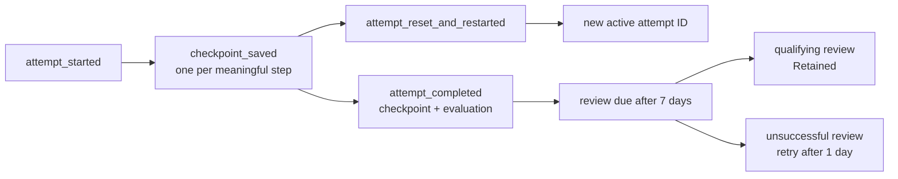

# Resume learning and prove retained mastery

Use this guide when a lesson is interrupted, when you want to restart an
attempt intentionally, or when the Product Shell says a review is due.

Do not edit learner-event files by hand. Do not mark mastery from a page view
or elapsed time. Mastery is always projected from completed, evaluated Learner
Attempts.

## Shortest correct path

1. Start the Product Shell with the same learning home:

   ```bash
   opslearn serve --home /tmp/ops-learning-home --port 8000
   ```

2. Reopen the attempt from **Attempt history**. The Product Shell restores the
   exact saved Learning Loop step, learner input, scenario seed, renderer state,
   and completion status.
3. To discard an active attempt, choose **Restart this whole attempt**. The
   old attempt becomes `reset`; a new traceable attempt begins at Map.
4. Complete a qualifying lesson. The Product Shell shows the scheduled review
   date seven days after completion.
5. When **Review due now** appears, choose **Begin due review** and complete the
   loop again.

An unsuccessful review keeps mastery at Demonstrated and schedules a retry one
day later. A qualifying due review advances it to Retained.

## How state moves



## What is stored

Private learner state lives under:

```text
<learning-home>/private/learner-state/events/
```

Each JSON event is immutable, content-addressed, and linked to the previous
event digest. The event types are:

- `attempt_started`;
- `checkpoint_saved`;
- `attempt_reset_and_restarted`; and
- `attempt_completed`.

There is no mutable `current.json` file and no `mastery_changed` event. The
Product Shell replays the event chain and derives:

- each attempt's active, completed, or reset status;
- whether the attempt is a learning or review attempt;
- current mastery;
- the review due date; and
- the exact review attempt that earned Retained.

Command IDs make an exact retry idempotent. A stale checkpoint, reused command
ID with different content, sequence gap, changed digest, unknown field, or
invalid event transition fails closed. The application does not overwrite the
last valid event to recover from corruption.

The chain detects edited events, reordered events, sequence gaps, and deletion
from inside the chain. Version 1 does **not** keep an independent durable head,
so it cannot distinguish deliberate deletion of the newest event or newest
suffix by the local learning-home owner from a history that always ended
there. Back up the private event directory if that local-owner threat matters.

Every append uses an exclusive learning-home lock and an atomic create. The
store then reads the exact bytes back before reporting success. On a filesystem
that cannot confirm directory `fsync`, this proves the event is visible and an
exact command retry can recover it; it does not claim the event will survive a
sudden host power loss.

## Reset means two different things

| Action | Attempt ID | Seed | Recorded history |
|---|---|---|---|
| **Reset this scenario** | Same | Same | Renderer action history records the reset. |
| **Restart this whole attempt** | New | Same | Old attempt becomes `reset`; new attempt begins at Map. |

Use scenario reset to retry the safe activity. Use whole-attempt restart when
you intentionally want to discard the current prediction or loop progress.
Reset attempts remain available from Attempt history as read-only evidence;
only their replacement can continue.

## Artifacts that prove success

For a demonstrated lesson:

- the terminal `LearnerAttemptRecord` binds the exact checkpoint and
  deterministic evaluation;
- the `attempt_completed` event binds that record into the private hash chain;
  and
- the derived review projection names the demonstration attempt and due date.

For retained mastery:

- the qualifying review has its own Learner Attempt ID and terminal record;
- its start event names the demonstration it reviews; and
- `MasteryProjection.earned_by_attempt_id` names that exact review attempt.

Passive GET requests, browser reloads, and time passing append no events.

## If learner state is corrupt

Stop when the shell shows **Learner history needs repair**. Preserve the event
directory for diagnosis. Do not delete, rename, or rewrite the newest file as
an automatic recovery step. The intact prefix remains the evidence of the last
valid state.

## Verification

Run:

```bash
./scripts/verify
./scripts/verify-browser
```

The focused tests prove exact mid-attempt process restart, command
idempotency, stale-head rejection, append-only whole-attempt restart,
corruption failure without repair writes, premature review rejection,
successful retention, unsuccessful-review retry, read-only due-page GETs, and
the real 320-pixel keyboard journey through reload, read-only reset history,
due review, and Retained mastery.
